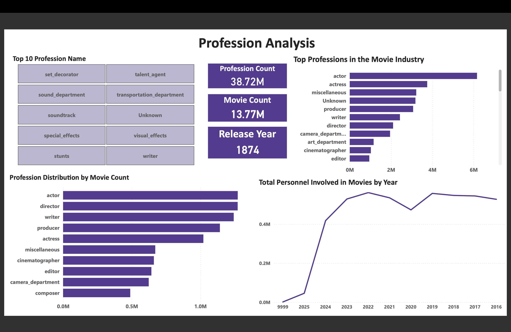

# 🎬 IMDB - Azure Data Pipeline and Analytics
Built a scalable data pipeline for 50M+ IMDb records using Azure Data Factory, Snowflake, and Alteryx, following Medallion Architecture. Streamlined data ingestion, transformation, and modeling to enable real-time insights through Power BI dashboards

## 📊 Objective

To extract, clean, analyze, and visualize IMDb movie data for answering key business questions related to:

- Movie genres and ratings trends  
- Crew and cast professions  
- Region and language-based release trends  
- Series vs non-series popularity  
- Top-rated movies and character insights

---

## 🛠️ Tech Stack

| Category        | Tools/Technologies                             |
|-----------------|------------------------------------------------|
| ETL             | Azure Data Factory (ADF), Alteryx              |
| Data Warehouse  | Snowflake                                      |
| Data Modeling   | ER Studio                                      |
| Profiling       | ydata-profiling (Python), Alteryx              |
| BI/Reporting    | Power BI                                       |
| Version Control | Git & GitHub                                   |
| Architecture    | Medallion (Bronze → Silver → Gold)             |

---

## 🗂️ Project Structure

imdb-bi-project/ ├── adf_pipelines/ # ADF JSON pipeline exports ├── profiling_reports/ # Profiling outputs (PDF/HTML) ├── data_modeling/ # ER diagrams, schema design files ├── mapping_document/ # Mapping_Template.xlsx ├── dashboard_reports/ # Power BI or Tableau reports ├── scripts/ # SQL or Python transformation scripts ├── documentation/ # Final report, PPT, writeups └── README.md # Project overview

---

## 📦 IMDb Dataset Overview

IMDb provides structured `.tsv.gz` files. Used files:

| File | Description | Row Count |
|------|-------------|-----------|
| name.basics | People in movies (cast, crew, etc) | 14M+ |
| title.akas | Titles in different languages & regions | 51M+ |
| title.crew | Directors and writers | 11M+ |
| title.basics | Basic movie details (genre, year) | 11M+ |
| title.episode | Episode mapping for series | 8.8M+ |
| title.principals | Main cast and crew | 90M+ |
| title.ratings | Ratings and votes | 1.5M+ |

**Additional Metadata:**
- Region codes: [Country Codes](https://www.iana.org/assignments/language-subtag-registry/language-subtag-registry)  
- Language codes: [ISO 639 List](https://en.wikipedia.org/wiki/List_of_ISO_639_language_codes)

---

## 🧩 Architecture & Features

- Data profiling using ydata-profiling
- Cleaned data using Alteryx and ADF pipelines  
- Unified schemas using Mapping Document (source-to-target)  
- Loaded clean data into Snowflake  
- STAR schema used for integration and reporting  
- Dashboards include slicers and filters for business users  
- Used **Medallion Architecture**:
  - **Bronze**: Raw ingested tables
  - **Silver**: Cleaned and transformed data
  - **Gold**: Final tables for BI & reporting

---

## 📊 Sample Dashboards

Dashboards created using **Power BI** 

